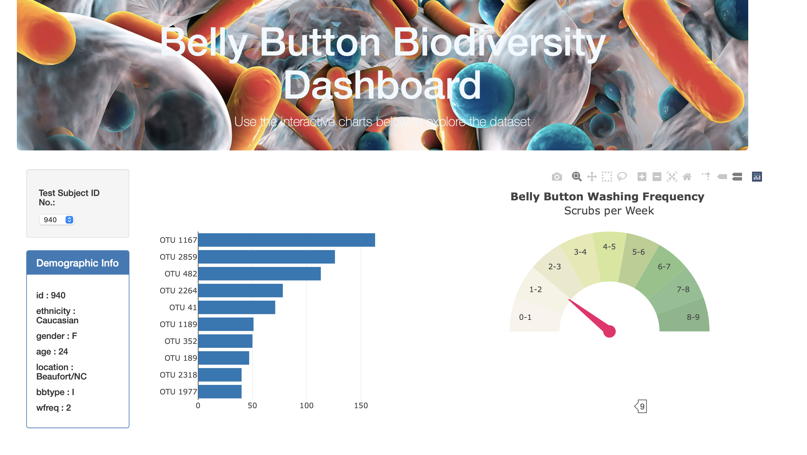
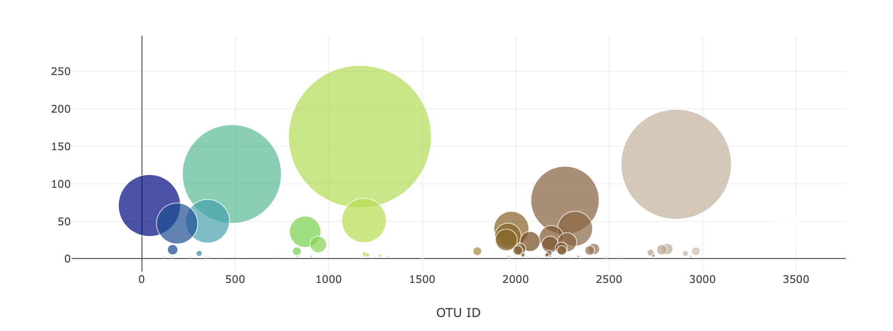

# # Plot.ly Homework - Belly Button Biodiversity

In this assignment I built interactive dashboards on plotly.

This microbes were present in more than 70% of people, while the rest were relatively rare.

## Building Vizualizations

1. There was created a horizontal chart to show bacteria found on each individual

2. There was created another visualization to show the frequency.

3.  There was created a final visualization to show the amount of bacteria on each individual.

